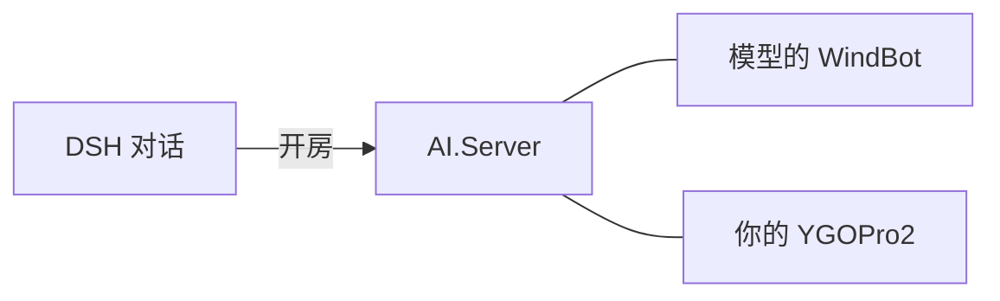

<div align="center">

# YGO Tools for DSH

DeepSeek Harness 的游戏王插件：查卡、卡组分析、Combo 推演、录像复盘，以及在 YGOPro2 里和模型对局。

[](https://github.com/mellfy-puppy/ygo-tools-for-dsh/releases/latest)
[](./LICENSE)


</div>

插件把卡片数据、禁限表、卡组管理和 OCG 规则引擎接入模型。模型给出的操作都会在规则引擎里检查是否合法。

## 安装

Release 提供两个安装包，插件代码相同：

| 安装包 | 内容 |
| :--- | :--- |
| `integrated` | 插件 + YGOPro2 客户端（不含卡图），不需要另装 YGOPro2 |
| `external` | 只有插件，对局时使用本机已安装的 YGOPro2 |

```powershell
# 附带客户端
dsh plugin --profile web add "https://github.com/mellfy-puppy/ygo-tools-for-dsh/releases/download/v1.4.0/ygo-tools-for-dsh-1.4.0-integrated.tgz"

# 不带客户端
dsh plugin --profile web add "https://github.com/mellfy-puppy/ygo-tools-for-dsh/releases/download/v1.4.0/ygo-tools-for-dsh-1.4.0-external.tgz"
```

安装后在 Web 界面新建会话，选择“游戏王模式”。如果没有出现，重启 DSH 后再新建会话。

## 与 AI 对局

v1.4.0 新增。在 DSH 里让模型载入卡组并开房，YGOPro2 会自动打开并进入房间，点准备即可开始。



- 对局开始后 DSH 会话自动继续，不需要再回 DSH 输入“开始”。
- 模型的每一步操作都显示在 DSH 对话里；游戏内聊天会转给模型，模型也能回复。
- 只有一个选项的决策（例如只能选“不连锁”）由插件直接处理，不再询问模型。
- 服务端和模型使用的 WindBot 随插件附带，使用插件内的卡库。更新卡库后，下次开房即生效。
- `integrated` 包只使用自带的客户端；`external` 包会查找本机安装的 YGOPro2，找不到时模型会给出房间地址，手动加入即可。

> [!IMPORTANT]
> 房间默认只监听 `127.0.0.1`。设置 `bindAddress:"0.0.0.0"` 可让局域网内的电脑加入，房间没有密码。

## 其他功能

- **卡片**：查询卡文、属性、数值，读取禁限表；正式卡和先行卡可联网增量更新。
- **卡组**：载入、检查、编辑、导出 YDK。
- **推演**：创建局面、固定起手、查看合法动作并执行，支持检查点回滚和分支比较。
- **复盘**：解析 YRP 录像；`learnDeck` 可把复盘结论保存为与卡组绑定的 Skill，下次载入同一卡组时自动使用。

## 工具

| 类别 | 工具 |
| :--- | :--- |
| 卡片 | `queryCards` `manageCardDataSources` `getBanlistContext` |
| 卡组 | `manageSessionDeck` `learnDeck` |
| 决斗 | `resetGame` `observeDuel` `executeAction` `simulateActions` |
| 状态 | `manageCheckpoint` `manageEngineSession` |
| 分析 | `analyzeCombo` `analyzeReplay` `saveArtifact` |
| 对局 | `manageYgoPro2`（`discover` `status` `host` `wait` `chat` `close`） |

## 运行方式

规则引擎在独立进程中运行（`127.0.0.1:19981`），第一次调用 YGO 工具时启动，DSH 重启后不受影响。决斗状态默认只保存在内存里，只有明确要求时才导出文件。

## 从源码打包

```powershell
node scripts/build-release.mjs external
node scripts/build-release.mjs integrated --client <YGOPro2 安装目录>
```

`integrated` 会去掉卡图、录像、卡组、客户端自带的 AI 和个人配置，再写入插件卡库。输出在 `dist/`。

<details>
<summary>项目结构</summary>

```text
lib/                            插件入口、DSH 技能说明
skill/backend/                  工具、会话、引擎服务与 YGOPro2 桥接
skill/resources/lib/            卡库、禁限表与卡片脚本
skill/resources/ygopro2-bridge/ AI.Server 与模型用的 WindBot
skill/vendor/                   随包附带的运行依赖
scripts/build-release.mjs       打包脚本
tests/                          自动化测试
```

</details>

## 许可

插件代码使用 [0BSD](./LICENSE)。AI.Server 和集成包内的 YGOPro2 客户端（[YGOProUnity_V2](https://github.com/lllyasviel/YGOProUnity_V2)）为 GPLv3，许可证随包附带。卡片数据库、禁限表和卡片脚本遵循各自上游项目的许可。卡图不随包分发。
