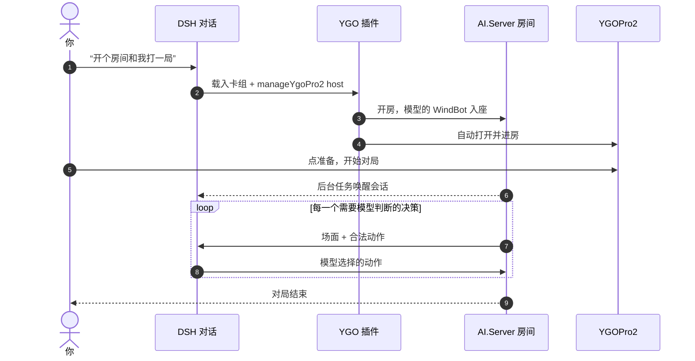
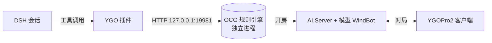

<div align="center">

# 🃏 YGO Tools for DSH

**让 DeepSeek Harness 的模型查卡、推演、复盘，还能在 YGOPro2 里和你打一局**

[](https://github.com/mellfy-puppy/ygo-tools-for-dsh/releases/latest)
[](./LICENSE)

[](https://nodejs.org/)

`卡片数据` · `卡组分析` · `OCG 规则引擎` · `Combo 推演` · `录像复盘` · `⚔️ 和模型对局`

[快速开始](#quick-start) · [v1.4.0 新内容](#whats-new) · [和模型对局](#play-the-model) · [工具一览](#tools) · [更新说明](./docs/release-1.4.0.md)

</div>

---

YGO Tools for DSH 是 DeepSeek Harness 的原生游戏王插件。它把卡片数据、禁限表、卡组管理和 OCG 规则引擎接进模型：模型说的每一步都要先在真实规则引擎里验证合法，而不是凭记忆背卡文。

<a id="whats-new"></a>

## ✨ v1.4.0 新内容

<table>
<tr>
<td width="50%" valign="top">

### ⚔️ 新增：在 YGOPro2 里和模型对局

- 对模型说“开个房间和我打”，插件开房并**自动打开 YGOPro2 进房**
- 你点开始后 DSH **自动接上**，模型每步操作都显示在对话里
- 游戏内**聊天双向转发**
- 只有“不连锁”这种**单选项窗口自动跳过**，一局少停 70% 左右
- 服务端随插件提供，**更新卡库后开房就用新卡**

</td>
<td width="50%" valign="top">

### 🔗 修复：连接怪兽的格子提示

- **箭头读错**：连接值被当成箭头，交织绵羊（左下/右下）曾显示成“箭头下”
- **格子偏移**：额外怪兽区的箭头整体错了一格，现在按 ocgcore 的算法计算
- 补全额外怪兽区指向对方场地、主怪兽区斜上指向额外怪兽区的情况

</td>
</tr>
</table>

> [!TIP]
> 完整改动见 [v1.4.0 更新说明](./docs/release-1.4.0.md) 和 [CHANGELOG](./CHANGELOG.md)。

<a id="quick-start"></a>

## 🚀 快速开始

Release 提供两个安装包，插件代码完全相同，区别只在是否自带对局客户端：

| 安装包 | 内容 | 适合 |
| :--- | :--- | :--- |
| 📦 **integrated** | 插件 + YGOPro2 客户端（不含卡图） | 没装 YGOPro2，想直接和模型对局 |
| 🪶 **external** | 只有插件 | 已经装了 YGOPro2，或只用卡查、推演 |

```powershell
# 集成包：自带对局客户端
dsh plugin --profile web add "https://github.com/mellfy-puppy/ygo-tools-for-dsh/releases/download/v1.4.0/ygo-tools-for-dsh-1.4.0-integrated.tgz"

# 外置包：使用本机已安装的 YGOPro2
dsh plugin --profile web add "https://github.com/mellfy-puppy/ygo-tools-for-dsh/releases/download/v1.4.0/ygo-tools-for-dsh-1.4.0-external.tgz"
```

安装后在 Web 界面新建会话，选择 **游戏王模式** 即可。

> [!NOTE]
> 如果没看到“游戏王模式”，重启 DSH 后再新建会话。升级前已经开始的会话会保留原来的模式。

<a id="play-the-model"></a>

## ⚔️ 和模型对局



**你只需要在 YGOPro2 里点准备。** 其余流程：

| 环节 | 做了什么 |
| :--- | :--- |
| 🏠 开房 | 插件用自带的 AI.Server 和自己的卡库开房，不读取本机 YGOPro2 的数据 |
| 🖥️ 进房 | 自动打开 YGOPro2 并加入房间；客户端已开着时直接切进房间 |
| ⏰ 接续 | 开房时登记 DSH 后台任务，你开始对局后自动唤醒会话 |
| 🧠 决策 | 模型拿到场面和合法动作再出手，每一步都显示在 DSH 对话里 |
| ⚡ 跳过 | 只有一个选项的决策（比如只有“不连锁”）由插件直接应答，结果里的 `autoResolved` 会列出来 |
| 💬 聊天 | 你在游戏里说的话会传给模型，模型也能回到游戏聊天框 |

> [!IMPORTANT]
> 房间默认只监听 `127.0.0.1`，只有本机能进。要让局域网其他电脑加入，需要明确让模型用 `bindAddress:"0.0.0.0"` 开房；房间没有密码，能访问这个端口的人都能进来。

<details>
<summary><b>集成包和外置包开房时有什么区别？</b></summary>

<br>

- **集成包**：只使用自带的 YGOPro2 客户端，开房前把插件卡库同步给它，不会搜索或改动本机其他 YGOPro2。
- **外置包**：按环境变量和常见安装位置查找本机 YGOPro2；找不到时，模型会把房间地址告诉你手动加入（IP + 端口，密码留空）。

两种包的服务端都随插件提供，卡库以插件为准。

</details>

## 🧩 主要能力

<table>
<tr>
<td width="33%" valign="top">

### 📚 卡片数据

查询卡片、卡文、属性、类型、数值和关联信息。

读取禁限表和卡库状态；正式卡与先行卡可以联网增量更新。

</td>
<td width="33%" valign="top">

### 🧪 卡组与 Combo

装载、检查、编辑和导出 YDK 卡组。

解析 Combo 路线，验证动作顺序，比较不同展开分支。

</td>
<td width="33%" valign="top">

### 🎲 决斗状态

创建局面、固定起手、观察合法动作并执行。

支持检查点回滚、录像分析，以及在 YGOPro2 里和模型对局。

</td>
</tr>
</table>

<a id="tools"></a>

## 🛠️ 工具一览

| 类别 | 工具 |
| :--- | :--- |
| **卡片** | `queryCards` · `manageCardDataSources` · `getBanlistContext` |
| **卡组** | `manageSessionDeck` · `learnDeck` |
| **决斗** | `resetGame` · `observeDuel` · `executeAction` · `simulateActions` |
| **状态** | `manageCheckpoint` · `manageEngineSession` |
| **分析** | `analyzeCombo` · `analyzeReplay` · `saveArtifact` |
| **对局** | `manageYgoPro2`：`discover` / `status` / `host` / `wait` / `chat` / `close` |

<details>
<summary><b>🎓 卡组录像学习（<code>learnDeck</code>）</b></summary>

<br>

从 YRP 录像里提取可见操作，由模型复盘总结策略要点（`strategyNotes`），保存为和卡组绑定的 Skill 文件。之后载入同一副卡组时自动激活。

- **卡组指纹**：覆盖主卡组、额外卡组和副卡组，忽略排列顺序、保留每张卡的数量。卡组改动后旧经验自动失效。
- **不是合法性证明**：录像经验只是策略参考，实际出手仍以运行时生成的合法动作为准。
- **五个操作**：`learn` / `list` / `get` / `activate` / `delete`。删除需要传 `confirm:true`。
- **存储位置**：默认 `$DSH_HOME/ygo-tools-for-dsh/deck-skills`，可用 `deckSkillDir` 或 `YGO_DECK_SKILL_DIR` 改。

```json
{ "action": "learn", "file": "C:/replays/example.yrp", "deckName": "我的卡组", "skillName": "my-deck", "strategyNotes": "由模型在复盘后填写策略总结。" }
```

</details>

## ⚙️ 运行方式



- 引擎按需启动；挂载插件本身不会启动决斗进程，DSH 重启后引擎保留。
- 决斗状态和研究过程默认只在内存里；只有明确要求时才导出路线、录像等文件。`learnDeck` 的 `learn` 会保存 Skill 文件。
- 内置规则引擎本身没有图形界面，对局画面由 YGOPro2 客户端提供。

## 🏗️ 从源码打包

```powershell
node scripts/build-release.mjs external
node scripts/build-release.mjs integrated --client <YGOPro2 安装目录>
```

`integrated` 会去掉卡图、录像、卡组、客户端自带的 AI 和个人配置（昵称重置为 `Player`），再写入插件卡库。输出在 `dist/`。

<details>
<summary><b>📁 项目结构</b></summary>

<br>

```text
lib/                          插件入口、DSH 技能说明、对局开始监听
skill/backend/                工具、会话、引擎服务与 YGOPro2 桥接
skill/resources/lib/          卡库、禁限表与卡片脚本
skill/resources/ygopro2-bridge/
  ├─ server/                  AI.Server（GPLv3）
  └─ windbot/                 模型用的 WindBot 及源码
skill/vendor/                 随包提供的运行依赖
scripts/build-release.mjs     两种发布包的打包脚本
tests/                        自动化测试
```

</details>

## 📄 许可

插件代码使用 [0BSD](./LICENSE)。

| 组件 | 许可 |
| :--- | :--- |
| AI.Server（`skill/resources/ygopro2-bridge/server`） | GPLv3，许可证随附 |
| YGOPro2 客户端（仅集成包，[YGOProUnity_V2](https://github.com/lllyasviel/YGOProUnity_V2)） | GPLv3，许可证随附 |
| 卡片数据库、禁限表、卡片脚本 | 遵循各自上游项目的许可 |

卡图不随包分发。

<div align="center">

<br>

**觉得有用的话，点个 ⭐ 吧**

</div>
